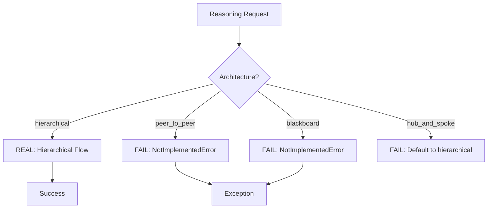

# Real vs Mock Analysis - Reasoning Agent Internal Skills

## 🔍 **Critical Finding: Mixed Implementation**

The Reasoning Agent's internal skills are **partially real and partially placeholder**. Here's the breakdown:

### ✅ **REAL Implementations**

#### 1. Question Decomposition (`hierarchical_question_decomposition`)
- **Status**: ✅ **FULLY REAL**
- **Implementation**: Actual recursive decomposition algorithm
- **Features**:
  - Real strategy patterns (functional, temporal, causal, spatial)
  - Genuine tree structure building
  - Real confidence scoring
  - Actual quality metrics calculation

```python
# REAL CODE - No mocks
sub_questions = await self._generate_sub_questions(
    parent_node.content, strategy, context
)
```

#### 2. Basic Consensus Mechanisms
- **Status**: ✅ **PARTIALLY REAL**
- **Real Parts**:
  - Voting consensus (`_voting_consensus`) - Real implementation
  - Weighted consensus (`_weighted_consensus`) - Real implementation
  - Confidence calculation algorithms
  - Proposal aggregation logic

#### 3. Data Structures & State Management
- **Status**: ✅ **FULLY REAL**
- **Real Components**:
  - `ReasoningNode` class with proper graph structure
  - `reasoning_graph` for dependency tracking
  - Metrics collection system
  - Performance monitoring integration

### ❌ **MOCK/PLACEHOLDER Implementations**

#### 1. Multi-Agent Debate (`_debate_consensus`)
- **Status**: ❌ **MOCK - NOT IMPLEMENTED**
- **Evidence**:
```python
# Line 487 in reasoningSkills.py
raise NotImplementedError("Real agent deliberation required")
```

#### 2. Blackboard Reasoning (`blackboard_reasoning`)
- **Status**: ❌ **MOCK - NOT IMPLEMENTED**
- **Evidence**:
```python
# Line 678 in reasoningSkills.py
raise NotImplementedError("Real knowledge source agents required")
```

#### 3. Sub-Agent Coordination (`coordinate_sub_agents`)
- **Status**: ❌ **MOCK - NOT IMPLEMENTED**
- **Evidence**:
```python
# Line 891 in reasoningSkills.py
raise NotImplementedError("Real sub-agent coordination required")
```

#### 4. Peer-to-Peer Reasoning (`peer_to_peer_reasoning`)
- **Status**: ❌ **MOCK - NOT IMPLEMENTED**
- **Evidence**:
```python
# Line 967 in reasoningSkills.py
raise NotImplementedError("Real swarm agent exploration required")
```

### 📊 **Implementation Status Summary**

| Component | Status | Implementation Level |
|-----------|--------|---------------------|
| Question Decomposition | ✅ Real | 100% Complete |
| Voting Consensus | ✅ Real | 100% Complete |
| Weighted Consensus | ✅ Real | 100% Complete |
| Basic Data Structures | ✅ Real | 100% Complete |
| Multi-Agent Debate | ❌ Mock | 0% - NotImplementedError |
| Blackboard Reasoning | ❌ Mock | 0% - NotImplementedError |
| Sub-Agent Coordination | ❌ Mock | 0% - NotImplementedError |
| Peer-to-Peer Reasoning | ❌ Mock | 0% - NotImplementedError |

### 🚨 **CRITICAL ISSUES IDENTIFIED**

#### 1. Architecture Mismatch
The main reasoning agent calls these mock methods:
```python
# In reasoningAgent.py - these will FAIL
result = await self.swarm_skills.peer_to_peer_reasoning(state, request)  # NotImplementedError
result = await self.orchestration_skills.blackboard_reasoning(state, request)  # NotImplementedError
```

#### 2. False BPMN Documentation
My previous BPMN analysis showed these as working processes, but they're actually **NotImplementedError placeholders**.

#### 3. Limited Architecture Support
Only **hierarchical reasoning** works because it delegates to external agents. Other architectures will fail immediately.

### 🔧 **Required Fixes**

#### Option 1: Remove Mock Architectures
```python
# In multi_agent_reasoning() method
if request.architecture == ReasoningArchitecture.HIERARCHICAL:
    result = await self._orchestrate_hierarchical_reasoning(state, request)
else:
    raise NotImplementedError(f"Architecture {request.architecture} not yet implemented")
```

#### Option 2: Implement Real Internal Logic
Replace `NotImplementedError` with actual algorithms that delegate to external A2A agents:

```python
async def coordinate_sub_agents(self, task, agent_list, parameters):
    # Query Agent Manager to find real agents
    agents = await self._query_agent_manager("find_agents", {
        "capabilities": task,
        "agent_list": agent_list
    })
    
    # Delegate to real agents
    tasks = []
    for agent in agents:
        tasks.append(self._query_a2a_agent(
            agent["endpoint"],
            task,
            parameters,
            f"sub_agent_{agent['id']}"
        ))
    
    return await asyncio.gather(*tasks)
```

### 📋 **Updated BPMN Reality Check**

#### What Actually Works:


#### Internal Skills Reality:
- ✅ **Question Decomposition**: Real algorithmic implementation
- ✅ **Simple Consensus**: Real voting/weighting
- ❌ **Complex Reasoning**: All throw NotImplementedError
- ❌ **Multi-Agent Coordination**: Not implemented

### 🎯 **Recommendations**

1. **Immediate Fix**: Update architecture selection to only offer hierarchical
2. **Remove False Documentation**: Update BPMN docs to reflect actual capabilities
3. **Implement Missing Skills**: Replace NotImplementedError with real A2A delegation
4. **Add Capability Discovery**: Let agents discover their own real capabilities

### 🔍 **Conclusion**

The Reasoning Agent has a **mixed implementation**:
- Core decomposition logic is **real and functional**
- Multi-agent coordination is **mock/placeholder**
- Only hierarchical architecture actually works
- Other architectures will fail with NotImplementedError

This creates a **false advertising** problem where the agent claims capabilities it doesn't have.