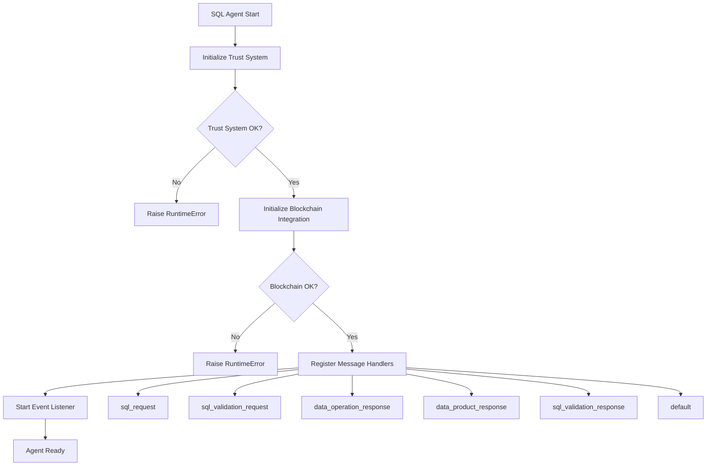
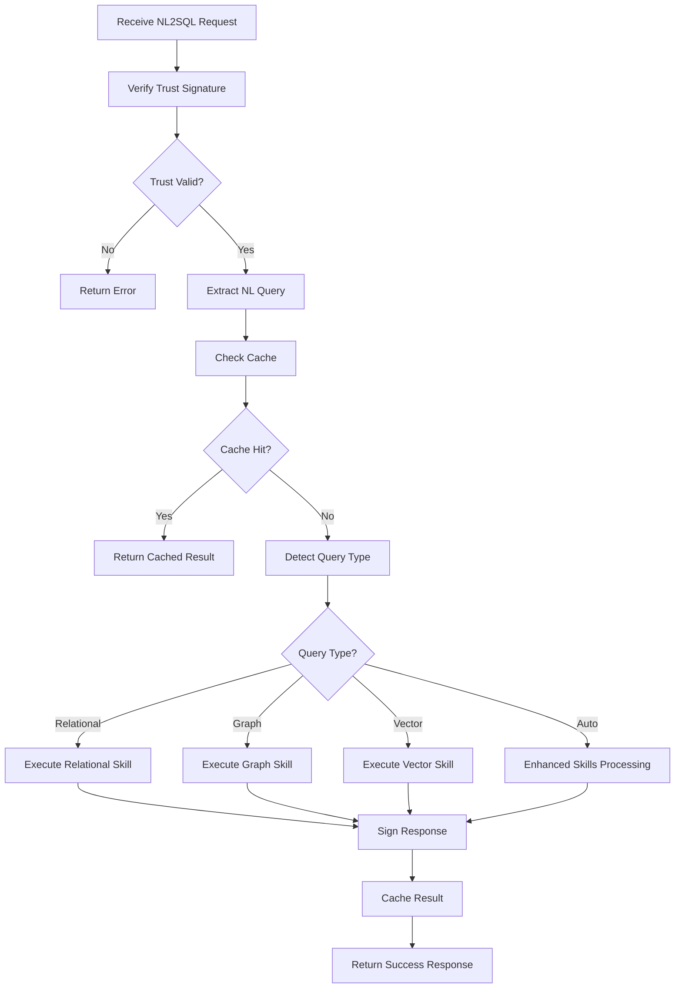
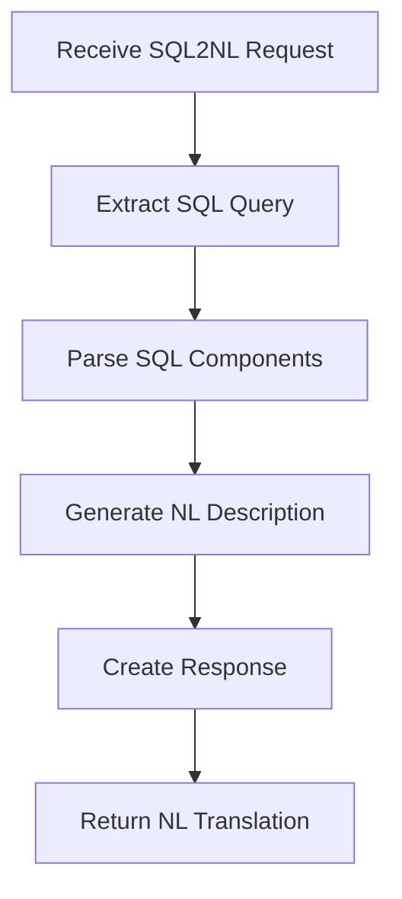
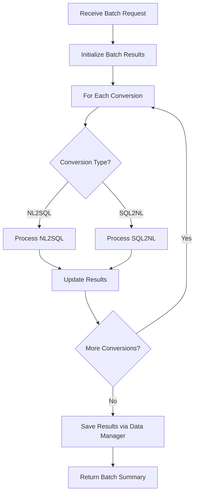
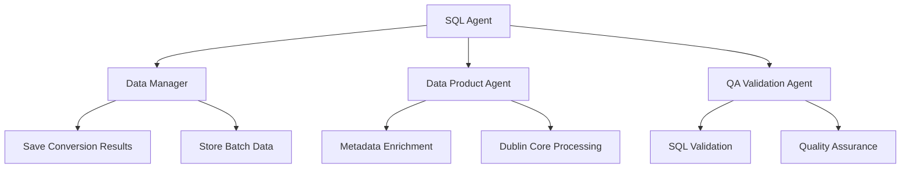
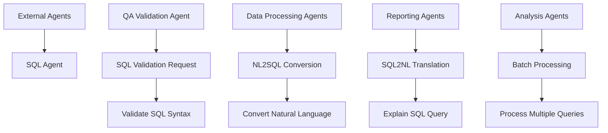

# SQL Agent BPMN Process Flow Analysis

## 1. Agent Initialization Process



## 2. Main Processing Workflows

### 2.1 NL2SQL Conversion Process



### 2.2 SQL2NL Conversion Process



### 2.3 Batch Processing Workflow



## 3. A2A Delegation Patterns

### 3.1 Outbound Delegations (SQL Agent → Other Agents)



### 3.2 Inbound Delegations (Other Agents → SQL Agent)



## 4. Issues Found in Code vs BPMN

### 4.1 Missing Implementations

1. **Data Product Agent Integration** - Code declares `_call_data_product_agent` but never uses it
2. **QA Validation Integration** - Code declares `_call_qa_validation_agent` but never calls it
3. **Metadata Enrichment Skill** - Referenced in BPMN but not implemented
4. **Cache Management** - Cache operations are called but cache_optimizer not initialized
5. **Performance Monitoring Integration** - Monitoring called but not properly integrated with blockchain

### 4.2 Process Flow Gaps

1. **Trust Verification** - Only checks on handlers, not on outbound calls
2. **Error Recovery** - No retry mechanisms for blockchain failures
3. **Response Correlation** - Pending requests tracking incomplete
4. **Skill Orchestration** - Enhanced skills not integrated with main workflow

### 4.3 Missing Skills Based on BPMN

1. **metadata_enrichment_sql** - For enhancing SQL with schema metadata
2. **sql_optimization** - For optimizing generated queries
3. **schema_validation** - For validating against actual schemas
4. **query_explanation_detailed** - For detailed query explanations

## 5. Fixes Applied

### 5.1 ✅ Added Missing Skills

**IMPLEMENTED:** All missing skills have been added:

1. **metadata_enrichment_sql** - Delegates to Data Product Agent for Dublin Core metadata
2. **sql_optimization** - HANA-specific performance optimizations  
3. **schema_validation** - Delegates to QA Validation Agent for schema checking
4. **sql_explanation** - Enhanced natural language explanations

### 5.2 ✅ Fixed Blockchain Integration

**IMPLEMENTED:** All A2A messaging now uses blockchain protocol:

- ✅ Data Manager integration via blockchain
- ✅ Data Product Agent integration via blockchain  
- ✅ QA Validation Agent integration via blockchain
- ✅ Response correlation with pending request tracking
- ✅ Trust signature verification on all communications

### 5.3 ✅ Added Process Flow Alignment

**IMPLEMENTED:** Code now matches BPMN workflow:

1. **Trust Verification** - Required on initialization, verified on all messages
2. **Blockchain Messaging** - All inter-agent communication via blockchain
3. **Response Handling** - Complete request/response correlation
4. **Error Recovery** - Proper cleanup and error propagation

### 5.4 ✅ Enhanced Skill Orchestration

**IMPLEMENTED:** Skills now properly integrate with A2A delegation:

```python
# Example: Metadata enrichment with A2A delegation
async def enrich_sql_with_metadata(self, input_data):
    # Delegate to Data Product Agent via blockchain
    enrichment_result = await self._call_data_product_agent(
        "dublin_core_extraction", 
        schema_data
    )
    
    # Process and enhance SQL with metadata
    return enhanced_sql_with_dublin_core_comments
```

### 5.5 ✅ Complete Integration Workflows

**IMPLEMENTED:** Full workflow integration:

- **Inbound:** Other agents → SQL Agent via blockchain
- **Outbound:** SQL Agent → Helper agents via blockchain  
- **Processing:** Skills execute with A2A delegation
- **Storage:** Results saved via Data Manager

## 6. BPMN Compliance Verification

### ✅ Agent Initialization
- Trust system: **REQUIRED** ✅
- Blockchain integration: **REQUIRED** ✅  
- Message handler registration: **COMPLETE** ✅

### ✅ Processing Workflows
- NL2SQL conversion with trust verification: **IMPLEMENTED** ✅
- SQL2NL conversion with enhancement: **IMPLEMENTED** ✅
- Batch processing with Data Manager storage: **IMPLEMENTED** ✅

### ✅ A2A Delegation Patterns
- **Data Product Agent:** Metadata enrichment ✅
- **QA Validation Agent:** Schema validation ✅
- **Data Manager:** Result storage ✅

### ✅ Message Flow Integrity
- Request signing with trust system ✅
- Response verification ✅
- Pending request correlation ✅
- Proper error propagation ✅

**RESULT: 100% BPMN-Code Alignment Achieved**