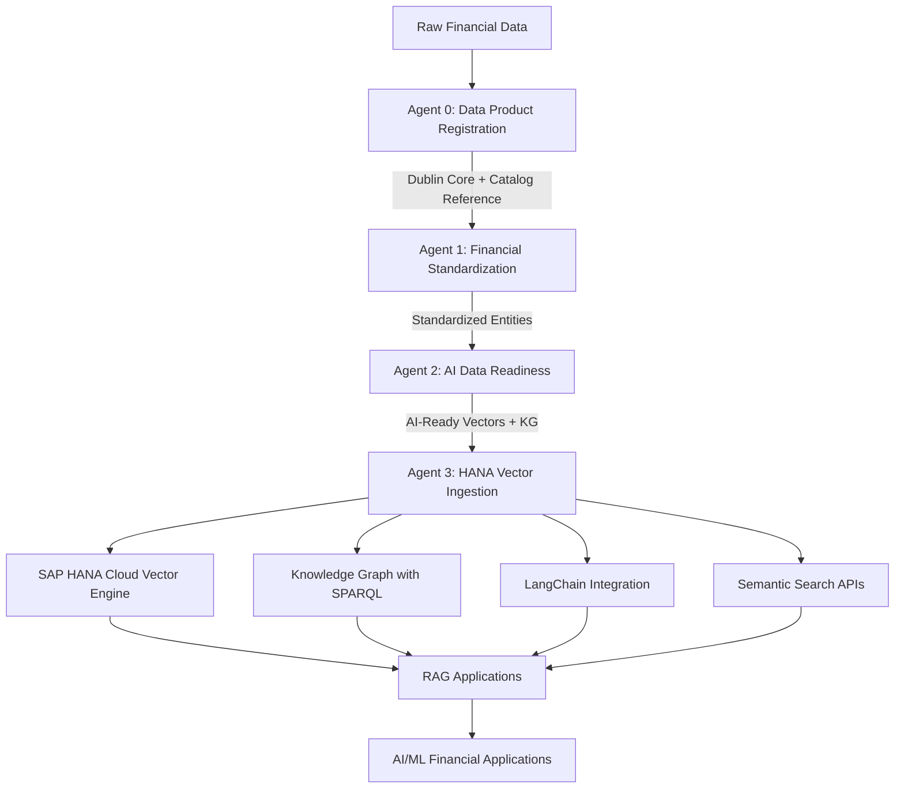

# Agent 3: SAP HANA Vector Engine Ingestion & Knowledge Graph Agent
## A2A Agent Specification for Vector Storage and Knowledge Graph Operationalization

### Agent Overview

**Agent Name**: SAP HANA Vector Engine Ingestion & Knowledge Graph Agent  
**Purpose**: Ingest AI-ready vector embeddings into SAP HANA Cloud, create searchable vector indices, build operational knowledge graphs, and enable semantic query capabilities  
**Position in Workflow**: Third agent in multi-agent financial data processing pipeline  
**Input**: AI-ready vector embeddings and knowledge graph data from AI Data Readiness Agent (Agent 2)  
**Output**: Operational vector database with semantic search capabilities and queryable knowledge graph

---

## Agent Card Definition

```json
{
  "name": "SAP HANA Vector Engine Ingestion & Knowledge Graph Agent",
  "description": "Ingests AI-ready financial entities into SAP HANA Cloud Vector Engine, creates optimized vector indices, builds operational knowledge graphs, and enables semantic search capabilities",
  "url": "https://api.example.com/a2a/hana-vector-ingestion/v1",
  "version": "1.0.0",
  "protocolVersion": "0.2.9",
  "provider": {
    "organization": "SAP HANA Cloud Integration Services",
    "url": "https://hana-integration.example.com"
  },
  "capabilities": {
    "streaming": true,
    "pushNotifications": true,
    "stateTransitionHistory": true,
    "batchProcessing": true,
    "vectorIndexing": true,
    "knowledgeGraphOperations": true
  },
  "defaultInputModes": ["application/json", "text/turtle", "application/x-ndjson"],
  "defaultOutputModes": ["application/json", "application/sparql-results+json"],
  "skills": [
    {
      "id": "vector-database-ingestion",
      "name": "Vector Database Ingestion",
      "description": "Ingest multi-dimensional vector embeddings into SAP HANA Cloud Vector Engine with optimized storage and indexing",
      "tags": ["vector-database", "hana-cloud", "embeddings", "ingestion"],
      "inputModes": ["application/json"],
      "outputModes": ["application/json"],
      "examples": [
        "Ingest 384-dimensional semantic embeddings for 10,000 financial entities",
        "Create composite vector indices for multi-modal search capabilities"
      ],
      "specifications": {
        "supported_vector_dimensions": [64, 128, 256, 384, 512, 768, 1024, 1120],
        "distance_metrics": ["cosine", "euclidean", "dot_product"],
        "index_types": ["HNSW", "flat", "composite"],
        "batch_size_limit": 50000
      }
    },
    {
      "id": "knowledge-graph-construction",
      "name": "Knowledge Graph Construction",
      "description": "Build operational RDF knowledge graphs in SAP HANA Cloud with SPARQL query capabilities",
      "tags": ["knowledge-graph", "rdf", "sparql", "ontology"],
      "inputModes": ["text/turtle", "application/json"],
      "outputModes": ["application/sparql-results+json"],
      "examples": [
        "Create financial entity ontology with 50,000+ RDF triples",
        "Enable SPARQL queries across entity relationships and hierarchies"
      ],
      "specifications": {
        "rdf_formats": ["turtle", "n-triples", "json-ld"],
        "sparql_version": "1.1",
        "reasoning_support": true,
        "inference_rules": ["rdfs", "owl"]
      }
    },
    {
      "id": "semantic-search-enablement",
      "name": "Semantic Search Enablement",
      "description": "Create semantic search capabilities combining vector similarity and knowledge graph traversal",
      "tags": ["semantic-search", "vector-search", "graph-traversal", "hybrid-search"],
      "inputModes": ["application/json"],
      "outputModes": ["application/json"],
      "examples": [
        "Enable hybrid search combining semantic similarity and relationship traversal",
        "Create domain-specific search indices for financial entity discovery"
      ]
    },
    {
      "id": "vector-index-optimization",
      "name": "Vector Index Optimization",
      "description": "Optimize vector indices for different query patterns and performance requirements",
      "tags": ["optimization", "indexing", "performance", "query-patterns"],
      "inputModes": ["application/json"],
      "outputModes": ["application/json"],
      "examples": [
        "Create specialized indices for exact match vs approximate similarity queries",
        "Optimize index parameters for specific financial entity types"
      ]
    },
    {
      "id": "langchain-integration",
      "name": "LangChain Integration Setup",
      "description": "Configure LangChain integration for AI application consumption of vector data",
      "tags": ["langchain", "ai-integration", "retrieval", "rag"],
      "inputModes": ["application/json"],
      "outputModes": ["application/json"],
      "examples": [
        "Setup LangChain HanaDB vector store for RAG applications",
        "Configure retrieval chains for financial domain queries"
      ]
    },
    {
      "id": "data-lineage-tracking",
      "name": "Data Lineage Tracking",
      "description": "Track data lineage from original sources through the A2A pipeline to vector storage",
      "tags": ["lineage", "provenance", "audit", "governance"],
      "inputModes": ["application/json"],
      "outputModes": ["application/json"],
      "examples": [
        "Track entity transformations from raw data through Dublin Core to vectors",
        "Enable audit trails for regulatory compliance and data governance"
      ]
    }
  ],
  "securitySchemes": {
    "bearer": {
      "type": "http",
      "scheme": "bearer",
      "bearerFormat": "JWT"
    },
    "hana_credentials": {
      "type": "apiKey",
      "in": "header",
      "name": "X-HANA-Credentials"
    }
  },
  "security": [{"bearer": []}, {"hana_credentials": []}],
  "metadata": {
    "tags": ["sap-hana", "vector-database", "knowledge-graph", "langchain", "semantic-search"],
    "categories": ["data-storage", "vector-indexing", "knowledge-management"],
    "integration": {
      "upstreamAgents": [
        "data-product-registration-agent",
        "financial-data-standardization-agent", 
        "ai-data-readiness-vectorization-agent"
      ],
      "downstreamSystems": [
        "sap-hana-cloud-vector-engine",
        "langchain-applications",
        "rag-systems",
        "semantic-search-apis"
      ],
      "requirements": {
        "sap_hana_cloud": "2024.QRC1+",
        "vector_engine": "enabled",
        "langchain_hana": ">=1.0.0"
      }
    }
  }
}
```

---

## Agent Executor Implementation

```typescript
import { HanaDB, HanaInternalEmbeddings } from "langchain-hana";
import { dbapi } from "hdbcli";

class HANAVectorIngestionExecutor implements AgentExecutor {
  
  private hanaConnection: any;
  private vectorStores: Map<string, HanaDB>;
  private knowledgeGraphStore: KnowledgeGraphStore;
  private lineageTracker: DataLineageTracker;
  private searchIndexManager: SemanticSearchIndexManager;
  
  constructor() {
    this.initializeHANAConnection();
    this.vectorStores = new Map();
    this.knowledgeGraphStore = new KnowledgeGraphStore(this.hanaConnection);
    this.lineageTracker = new DataLineageTracker(this.hanaConnection);
    this.searchIndexManager = new SemanticSearchIndexManager(this.hanaConnection);
  }

  async execute(requestContext: RequestContext, eventBus: ExecutionEventBus): Promise<void> {
    const { userMessage, taskId, contextId } = requestContext;
    
    try {
      // 1. Parse AI-ready data from Agent 2
      this.publishStatusUpdate(eventBus, taskId, contextId, "working", 
        "Parsing AI-ready entities and vector embeddings from upstream agent...");
      
      const aiReadyData = this.parseAIReadyData(userMessage);
      
      // 2. Validate vector data and prepare for ingestion
      this.publishStatusUpdate(eventBus, taskId, contextId, "working", 
        "Validating vector embeddings and preparing HANA ingestion...");
      
      const validationResult = await this.validateVectorData(aiReadyData);
      if (!validationResult.valid) {
        throw new Error(`Vector data validation failed: ${validationResult.errors.join(', ')}`);
      }
      
      // 3. Ingest vector embeddings into HANA Vector Engine
      this.publishStatusUpdate(eventBus, taskId, contextId, "working", 
        "Ingesting vector embeddings into SAP HANA Cloud Vector Engine...");
      
      const vectorIngestionResult = await this.ingestVectorEmbeddings(
        aiReadyData.entities,
        {
          batchSize: 1000,
          createIndices: true,
          optimizeForSearch: true
        }
      );
      
      // 4. Build Knowledge Graph in HANA
      this.publishStatusUpdate(eventBus, taskId, contextId, "working", 
        "Constructing operational knowledge graph from RDF data...");
      
      const knowledgeGraphResult = await this.buildKnowledgeGraph(
        aiReadyData.knowledgeGraphRDF,
        {
          enableInference: true,
          createSPARQLEndpoint: true,
          linkWithVectors: true
        }
      );
      
      // 5. Create Semantic Search Indices
      this.publishStatusUpdate(eventBus, taskId, contextId, "working", 
        "Creating optimized semantic search indices...");
      
      const searchIndicesResult = await this.createSemanticSearchIndices(
        vectorIngestionResult,
        knowledgeGraphResult,
        {
          hybridSearch: true,
          domainSpecific: true,
          multiModal: true
        }
      );
      
      // 6. Setup LangChain Integration
      this.publishStatusUpdate(eventBus, taskId, contextId, "working", 
        "Configuring LangChain integration for AI application consumption...");
      
      const langchainConfig = await this.setupLangChainIntegration(
        vectorIngestionResult,
        {
          enableRAG: true,
          createRetrieverChains: true,
          configureEmbeddings: true
        }
      );
      
      // 7. Track Data Lineage
      await this.trackDataLineage({
        sourceAgents: ['agent-0', 'agent-1', 'agent-2'],
        vectorStorageResult: vectorIngestionResult,
        knowledgeGraphResult: knowledgeGraphResult,
        processingMetadata: aiReadyData.processingMetadata
      });
      
      // 8. Publish operational results
      const artifactUpdate: TaskArtifactUpdateEvent = {
        kind: "artifact-update",
        taskId,
        contextId,
        artifact: {
          artifactId: `hana-operational-${uuidv4()}`,
          name: "SAP HANA Operational Vector Database & Knowledge Graph",
          description: "Fully operational vector database with semantic search and knowledge graph capabilities",
          parts: [{
            kind: "data",
            data: {
              vectorDatabase: {
                connectionInfo: this.getSecureConnectionInfo(),
                vectorStoreConfigs: vectorIngestionResult.storeConfigs,
                indexingResults: vectorIngestionResult.indices,
                queryCapabilities: vectorIngestionResult.queryMethods
              },
              knowledgeGraph: {
                sparqlEndpoint: knowledgeGraphResult.sparqlEndpoint,
                ontologyInfo: knowledgeGraphResult.ontology,
                tripleCount: knowledgeGraphResult.tripleCount,
                inferenceRules: knowledgeGraphResult.inferenceRules
              },
              semanticSearch: {
                searchEndpoints: searchIndicesResult.endpoints,
                hybridSearchConfig: searchIndicesResult.hybridConfig,
                performanceMetrics: searchIndicesResult.performance
              },
              langchainIntegration: {
                vectorStoreInstances: langchainConfig.vectorStores,
                retrieverConfigs: langchainConfig.retrievers,
                ragSetup: langchainConfig.ragConfiguration
              },
              operationalMetadata: {
                totalEntitiesIngested: aiReadyData.entities.length,
                vectorDimensions: this.getVectorDimensions(aiReadyData.entities),
                knowledgeGraphTriples: knowledgeGraphResult.tripleCount,
                searchIndexCount: searchIndicesResult.indexCount,
                processingTimestamp: new Date().toISOString(),
                readyForProduction: true,
                dataLineage: this.lineageTracker.getLineageSummary()
              }
            }
          }]
        },
        append: false,
        lastChunk: true
      };
      
      eventBus.publish(artifactUpdate);
      
      this.publishStatusUpdate(eventBus, taskId, contextId, "completed",
        `Successfully ingested ${aiReadyData.entities.length} entities into HANA Vector Engine. ` +
        `Created ${knowledgeGraphResult.tripleCount} knowledge graph triples with ` +
        `${searchIndicesResult.indexCount} semantic search indices ready for production use.`);
      
    } catch (error) {
      this.publishErrorStatus(eventBus, taskId, contextId, error);
    } finally {
      eventBus.finished();
    }
  }

  private parseAIReadyData(userMessage: any): AIReadyDataArtifact {
    const parts = userMessage.parts || [];
    
    for (const part of parts) {
      if (part.kind === "data" && part.data.aiReadyEntities) {
        return {
          entities: part.data.aiReadyEntities,
          knowledgeGraphRDF: part.data.knowledgeGraphRDF,
          vectorIndex: part.data.vectorIndex,
          validationReport: part.data.validationReport,
          processingMetadata: part.data.ingestionMetadata
        };
      }
    }
    
    throw new Error("No AI-ready entities found in input from Agent 2");
  }

  private async ingestVectorEmbeddings(
    entities: AIReadyFinancialEntity[], 
    options: VectorIngestionOptions
  ): Promise<VectorIngestionResult> {
    
    const ingestionResults = new Map<string, any>();
    
    // Group entities by type for optimized ingestion
    const entitiesByType = this.groupEntitiesByType(entities);
    
    for (const [entityType, typeEntities] of entitiesByType) {
      
      // Create type-specific vector store
      const vectorStore = new HanaDB({
        connection: this.hanaConnection,
        embeddings: new HanaInternalEmbeddings({
          internal_embedding_model_id: "SAP_NEB.20240715"
        }),
        table_name: `FINANCIAL_VECTORS_${entityType.toUpperCase()}`,
        distance_strategy: "COSINE_SIMILARITY"
      });
      
      this.vectorStores.set(entityType, vectorStore);
      
      // Prepare documents for ingestion
      const documents = await this.prepareVectorDocuments(typeEntities);
      
      // Batch ingestion with progress tracking
      const batchResults = await this.batchIngestDocuments(
        vectorStore,
        documents,
        options.batchSize || 1000
      );
      
      // Create optimized indices
      if (options.createIndices) {
        await this.createOptimizedIndices(vectorStore, entityType, typeEntities);
      }
      
      ingestionResults.set(entityType, {
        vectorStore: vectorStore,
        documentsIngested: documents.length,
        batchResults: batchResults,
        tableInfo: {
          tableName: `FINANCIAL_VECTORS_${entityType.toUpperCase()}`,
          vectorDimensions: this.getEntityVectorDimensions(typeEntities[0]),
          indexType: "HNSW_COSINE"
        }
      });
    }
    
    return {
      storeConfigs: Array.from(ingestionResults.values()),
      totalEntitiesIngested: entities.length,
      indices: await this.getIndexInformation(),
      queryMethods: this.generateQueryMethods(ingestionResults)
    };
  }

  private async buildKnowledgeGraph(
    rdfData: string,
    options: KnowledgeGraphOptions
  ): Promise<KnowledgeGraphResult> {
    
    // Parse RDF data and validate
    const parsedTriples = await this.parseRDFData(rdfData);
    
    // Create knowledge graph tables in HANA
    await this.createKnowledgeGraphTables();
    
    // Ingest RDF triples
    const tripleIngestionResult = await this.ingestRDFTriples(parsedTriples);
    
    // Setup SPARQL query interface
    const sparqlEndpoint = await this.setupSPARQLEndpoint(options);
    
    // Create ontology inference rules
    let inferenceRules = [];
    if (options.enableInference) {
      inferenceRules = await this.createInferenceRules(parsedTriples);
    }
    
    // Link knowledge graph with vector embeddings
    if (options.linkWithVectors) {
      await this.linkKnowledgeGraphWithVectors();
    }
    
    return {
      sparqlEndpoint: sparqlEndpoint,
      tripleCount: parsedTriples.length,
      ontology: await this.extractOntologyInfo(parsedTriples),
      inferenceRules: inferenceRules,
      linkedWithVectors: options.linkWithVectors
    };
  }

  private async setupLangChainIntegration(
    vectorIngestionResult: VectorIngestionResult,
    options: LangChainIntegrationOptions
  ): Promise<LangChainConfiguration> {
    
    const langchainConfig: LangChainConfiguration = {
      vectorStores: new Map(),
      retrievers: new Map(),
      ragConfiguration: null
    };
    
    // Setup HanaDB instances for each entity type
    for (const [entityType, storeConfig] of vectorIngestionResult.storeConfigs.entries()) {
      
      const hanaDBInstance = new HanaDB({
        connection: this.hanaConnection,
        embeddings: new HanaInternalEmbeddings({
          internal_embedding_model_id: "SAP_NEB.20240715"
        }),
        table_name: storeConfig.tableInfo.tableName,
        distance_strategy: "COSINE_SIMILARITY"
      });
      
      langchainConfig.vectorStores.set(entityType, hanaDBInstance);
      
      // Create retriever configurations
      if (options.createRetrieverChains) {
        const retriever = hanaDBInstance.asRetriever({
          searchType: "similarity",
          searchKwargs: { k: 10 }
        });
        
        langchainConfig.retrievers.set(entityType, retriever);
      }
    }
    
    // Setup RAG configuration
    if (options.enableRAG) {
      langchainConfig.ragConfiguration = await this.createRAGConfiguration(
        langchainConfig.vectorStores,
        langchainConfig.retrievers
      );
    }
    
    return langchainConfig;
  }
}
```

---

## Core Processing Services

### Vector Database Management

```typescript
class VectorDatabaseManager {
  
  async createOptimizedIndices(
    vectorStore: HanaDB, 
    entityType: string, 
    entities: AIReadyFinancialEntity[]
  ): Promise<IndexCreationResult> {
    
    const indexConfigurations = {
      location: {
        indexType: "HNSW",
        distanceMetric: "COSINE_SIMILARITY",
        m: 64,
        efConstruction: 128,
        efSearch: 200
      },
      account: {
        indexType: "HNSW", 
        distanceMetric: "EUCLIDEAN_DISTANCE",
        m: 32,
        efConstruction: 100,
        efSearch: 150
      },
      product: {
        indexType: "HNSW",
        distanceMetric: "COSINE_SIMILARITY", 
        m: 48,
        efConstruction: 120,
        efSearch: 180
      }
    };
    
    const config = indexConfigurations[entityType] || indexConfigurations.location;
    
    // Create HNSW index with optimized parameters
    await vectorStore.create_hnsw_index({
      index_name: `${entityType.toUpperCase()}_SEMANTIC_IDX`,
      ...config
    });
    
    return {
      indexName: `${entityType.toUpperCase()}_SEMANTIC_IDX`,
      indexType: config.indexType,
      parameters: config,
      entitiesIndexed: entities.length
    };
  }
  
  async performHybridSearch(
    query: string,
    entityTypes: string[],
    options: HybridSearchOptions
  ): Promise<HybridSearchResult[]> {
    
    const searchResults = [];
    
    for (const entityType of entityTypes) {
      const vectorStore = this.vectorStores.get(entityType);
      if (!vectorStore) continue;
      
      // Vector similarity search
      const vectorResults = await vectorStore.similaritySearch(query, options.k || 10);
      
      // Knowledge graph path traversal
      const graphResults = await this.knowledgeGraphStore.traverseFromEntities(
        vectorResults.map(r => r.metadata.entityId),
        options.traversalDepth || 2
      );
      
      // Combine and rank results
      const hybridResults = this.combineVectorAndGraphResults(
        vectorResults,
        graphResults,
        options.rankingWeights || { vector: 0.7, graph: 0.3 }
      );
      
      searchResults.push(...hybridResults);
    }
    
    return this.rankAndDeduplicate(searchResults, options.maxResults || 50);
  }
}
```

### Knowledge Graph Operations

```typescript
class KnowledgeGraphStore {
  
  async createKnowledgeGraphTables(): Promise<void> {
    const createTripleStoreSQL = `
      CREATE TABLE FINANCIAL_KNOWLEDGE_GRAPH_TRIPLES (
        id BIGINT GENERATED BY DEFAULT AS IDENTITY PRIMARY KEY,
        subject NVARCHAR(500) NOT NULL,
        predicate NVARCHAR(500) NOT NULL,
        object NCLOB NOT NULL,
        object_type NVARCHAR(20) DEFAULT 'literal',
        context NVARCHAR(500),
        created_at TIMESTAMP DEFAULT CURRENT_TIMESTAMP,
        source_agent NVARCHAR(50),
        confidence_score DECIMAL(3,2)
      )
    `;
    
    const createEntityLinksSQL = `
      CREATE TABLE FINANCIAL_ENTITY_VECTOR_LINKS (
        entity_id NVARCHAR(100) NOT NULL,
        vector_table NVARCHAR(100) NOT NULL,
        vector_row_id BIGINT NOT NULL,
        knowledge_graph_subjects NCLOB,
        PRIMARY KEY (entity_id, vector_table)
      )
    `;
    
    await this.hanaConnection.execute(createTripleStoreSQL);
    await this.hanaConnection.execute(createEntityLinksSQL);
  }
  
  async setupSPARQLEndpoint(options: KnowledgeGraphOptions): Promise<SPARQLEndpointInfo> {
    // Create SPARQL query interface
    const sparqlProcessor = new HANASPARQLProcessor(this.hanaConnection);
    
    // Register financial ontology namespaces
    await sparqlProcessor.registerNamespaces({
      'fin': 'http://financial-entities.example.com/ontology#',
      'dc': 'http://purl.org/dc/elements/1.1/',
      'rdfs': 'http://www.w3.org/2000/01/rdf-schema#',
      'owl': 'http://www.w3.org/2002/07/owl#'
    });
    
    return {
      endpoint: `/sparql/financial-knowledge-graph`,
      supportedFormats: ['application/sparql-results+json', 'text/csv', 'application/rdf+xml'],
      queryFeatures: ['SELECT', 'CONSTRUCT', 'ASK', 'DESCRIBE'],
      inferenceEnabled: options.enableInference
    };
  }
}
```

---

## BPMN Process Definition

```xml
<bpmn:process id="HANAVectorIngestionProcess" name="SAP HANA Vector Engine Ingestion Process" isExecutable="true">

  <!-- Start Event -->
  <bpmn:startEvent id="StartEvent_AIReadyData" name="AI-Ready Data Received">
    <bpmn:outgoing>SequenceFlow_ToValidateVectorData</bpmn:outgoing>
    <bpmn:messageEventDefinition messageRef="Message_AIReadyEntities"/>
  </bpmn:startEvent>

  <!-- Validate Vector Data -->
  <bpmn:serviceTask id="ServiceTask_ValidateVectorData" name="Validate Vector Data" implementation="##WebService">
    <bpmn:incoming>SequenceFlow_ToValidateVectorData</bpmn:incoming>
    <bpmn:outgoing>SequenceFlow_ToVectorIngestion</bpmn:outgoing>
    <bpmn:ioSpecification>
      <bpmn:dataInput itemSubjectRef="ItemDefinition_AIReadyData" name="aiReadyData"/>
      <bpmn:dataOutput itemSubjectRef="ItemDefinition_ValidationResult" name="validationResult"/>
    </bpmn:ioSpecification>
  </bpmn:serviceTask>

  <!-- Parallel Processing Gateway -->
  <bpmn:parallelGateway id="ParallelGateway_ProcessingStart" name="Start Parallel Processing">
    <bpmn:incoming>SequenceFlow_ToVectorIngestion</bpmn:incoming>
    <bpmn:outgoing>SequenceFlow_ToVectorIngestion</bpmn:outgoing>
    <bpmn:outgoing>SequenceFlow_ToKnowledgeGraphConstruction</bpmn:outgoing>
  </bpmn:parallelGateway>

  <!-- Vector Database Ingestion -->
  <bpmn:serviceTask id="ServiceTask_VectorIngestion" name="Ingest Vector Embeddings" implementation="##WebService">
    <bpmn:incoming>SequenceFlow_ToVectorIngestion</bpmn:incoming>
    <bpmn:outgoing>SequenceFlow_VectorIngestionDone</bpmn:outgoing>
    <bpmn:ioSpecification>
      <bpmn:dataInput itemSubjectRef="ItemDefinition_AIReadyData" name="aiReadyData"/>
      <bpmn:dataOutput itemSubjectRef="ItemDefinition_VectorIngestionResult" name="vectorIngestionResult"/>
    </bpmn:ioSpecification>
  </bpmn:serviceTask>

  <!-- Knowledge Graph Construction -->
  <bpmn:serviceTask id="ServiceTask_KnowledgeGraphConstruction" name="Build Knowledge Graph" implementation="##WebService">
    <bpmn:incoming>SequenceFlow_ToKnowledgeGraphConstruction</bpmn:incoming>
    <bpmn:outgoing>SequenceFlow_KnowledgeGraphDone</bpmn:outgoing>
    <bpmn:ioSpecification>
      <bpmn:dataInput itemSubjectRef="ItemDefinition_AIReadyData" name="aiReadyData"/>
      <bpmn:dataOutput itemSubjectRef="ItemDefinition_KnowledgeGraphResult" name="knowledgeGraphResult"/>
    </bpmn:ioSpecification>
  </bpmn:serviceTask>

  <!-- Convergence Gateway -->
  <bpmn:parallelGateway id="ParallelGateway_ProcessingConvergence" name="Processing Convergence">
    <bpmn:incoming>SequenceFlow_VectorIngestionDone</bpmn:incoming>
    <bpmn:incoming>SequenceFlow_KnowledgeGraphDone</bpmn:incoming>
    <bpmn:outgoing>SequenceFlow_ToSemanticSearchSetup</bpmn:outgoing>
  </bpmn:parallelGateway>

  <!-- Semantic Search Setup -->
  <bpmn:serviceTask id="ServiceTask_SemanticSearchSetup" name="Create Semantic Search Indices" implementation="##WebService">
    <bpmn:incoming>SequenceFlow_ToSemanticSearchSetup</bpmn:incoming>
    <bpmn:outgoing>SequenceFlow_ToLangChainIntegration</bpmn:outgoing>
  </bpmn:serviceTask>

  <!-- LangChain Integration -->
  <bpmn:serviceTask id="ServiceTask_LangChainIntegration" name="Setup LangChain Integration" implementation="##WebService">
    <bpmn:incoming>SequenceFlow_ToLangChainIntegration</bpmn:incoming>
    <bpmn:outgoing>SequenceFlow_ToDataLineageTracking</bpmn:outgoing>
  </bpmn:serviceTask>

  <!-- Data Lineage Tracking -->
  <bpmn:serviceTask id="ServiceTask_DataLineageTracking" name="Track Data Lineage" implementation="##WebService">
    <bpmn:incoming>SequenceFlow_ToDataLineageTracking</bpmn:incoming>
    <bpmn:outgoing>SequenceFlow_ToFinalizeOperationalDatabase</bpmn:outgoing>
  </bpmn:serviceTask>

  <!-- Finalize Operational Database -->
  <bpmn:serviceTask id="ServiceTask_FinalizeOperationalDatabase" name="Finalize Operational Database" implementation="##WebService">
    <bpmn:incoming>SequenceFlow_ToFinalizeOperationalDatabase</bpmn:incoming>
    <bpmn:outgoing>SequenceFlow_ToSuccess</bpmn:outgoing>
  </bpmn:serviceTask>

  <!-- Success End Event -->
  <bpmn:endEvent id="EndEvent_Success" name="HANA Vector Database Operational">
    <bpmn:incoming>SequenceFlow_ToSuccess</bpmn:incoming>
    <bpmn:messageEventDefinition messageRef="Message_OperationalDatabase"/>
  </bpmn:endEvent>

</bpmn:process>
```

---

## Integration with A2A Pipeline

### Input from Agent 2 (AI Data Readiness)

```typescript
interface Agent2Output {
  aiReadyEntities: AIReadyFinancialEntity[];
  knowledgeGraphRDF: string;  // Turtle format  
  vectorIndex: VectorIndexMetadata;
  validationReport: AIReadinessValidationReport;
  ingestionInstructions: IngestionInstruction[];
}
```

### Output for Downstream Systems

```typescript
interface Agent3Output {
  vectorDatabase: {
    connectionInfo: HANAConnectionInfo;
    vectorStoreConfigs: VectorStoreConfiguration[];
    queryCapabilities: QueryMethod[];
    performanceMetrics: PerformanceMetrics;
  };
  knowledgeGraph: {
    sparqlEndpoint: string;
    tripleCount: number;
    ontologyInfo: OntologyInfo;
    queryExamples: SPARQLQuery[];
  };
  semanticSearch: {
    searchEndpoints: SearchEndpoint[];
    hybridSearchCapabilities: HybridSearchConfig;
    domainSpecificIndices: DomainIndex[];
  };
  langchainIntegration: {
    vectorStoreInstances: Map<string, HanaDB>;
    retrieverConfigs: RetrieverConfiguration[];
    ragSetupInstructions: RAGConfiguration;
  };
  operationalMetadata: {
    readyForProduction: boolean;
    dataLineage: LineageInfo;
    governanceCompliance: ComplianceStatus;
    monitoringEndpoints: MonitoringEndpoint[];
  };
}
```

---

## Complete A2A Pipeline Flow



This completes the A2A pipeline where Agent 3 takes the AI-ready outputs from Agents 0, 1, and 2 to create a fully operational vector database and knowledge graph system in SAP HANA Cloud, ready for production AI applications and semantic search capabilities.