# Internal BPMN Analysis - Reasoning Agent

## Agent Internal Workflow Architecture

### 1. Main Entry Points (Start Events)

#### A. External Entry Point
- **@a2a_skill**: `multi_agent_reasoning`
- **@a2a_handler**: `executeReasoningTask`
- **Input**: ReasoningRequest with question, context, architecture type

#### B. Architecture Decision Gateway
```
Decision Point: request.architecture
├── hierarchical → _orchestrate_hierarchical_reasoning()
├── peer_to_peer → swarm_skills.peer_to_peer_reasoning()
├── blackboard → orchestration_skills.blackboard_reasoning()
├── hub_and_spoke → (default to hierarchical)
├── graph_based → (default to hierarchical)
└── hybrid → (default to hierarchical)
```

### 2. Hierarchical Reasoning Process (Main Flow)

#### Phase 1: Question Analysis
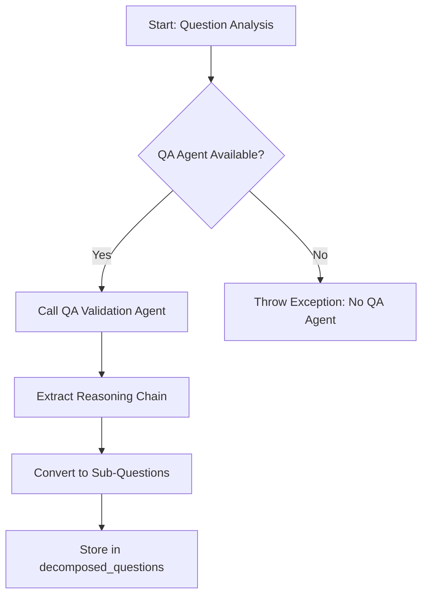

**BPMN Elements**:
- **Service Task**: Query QA Validation Agent (http://localhost:8007)
- **Business Rule**: Extract sub-questions from reasoning chain
- **Data Store**: Update `state.decomposed_questions`

#### Phase 2: Evidence Retrieval
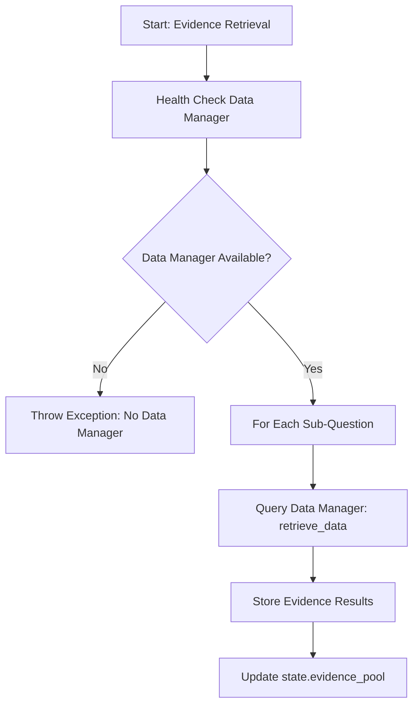

**BPMN Elements**:
- **Service Task**: Health check Data Manager
- **Multi-Instance Sub-Process**: Query for each sub-question
- **Data Store**: Update `state.evidence_pool`

#### Phase 3: Reasoning
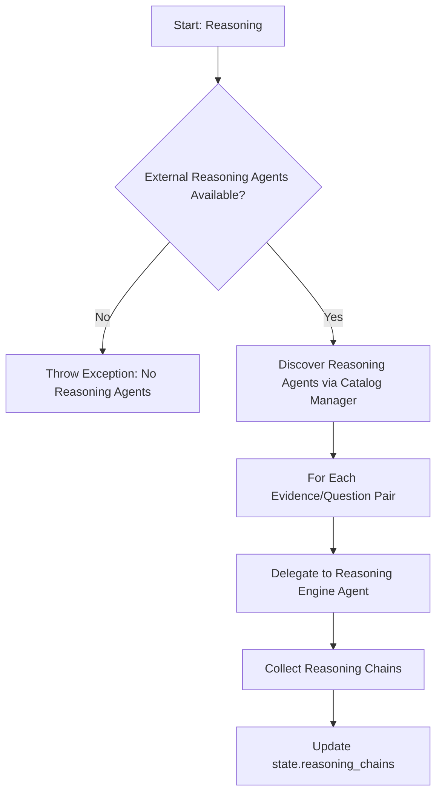

**BPMN Elements**:
- **Service Task**: Query Catalog Manager for agent discovery
- **Multi-Instance Sub-Process**: Parallel reasoning tasks
- **Data Store**: Update `state.reasoning_chains`

#### Phase 4: Multi-Agent Debate (Optional)
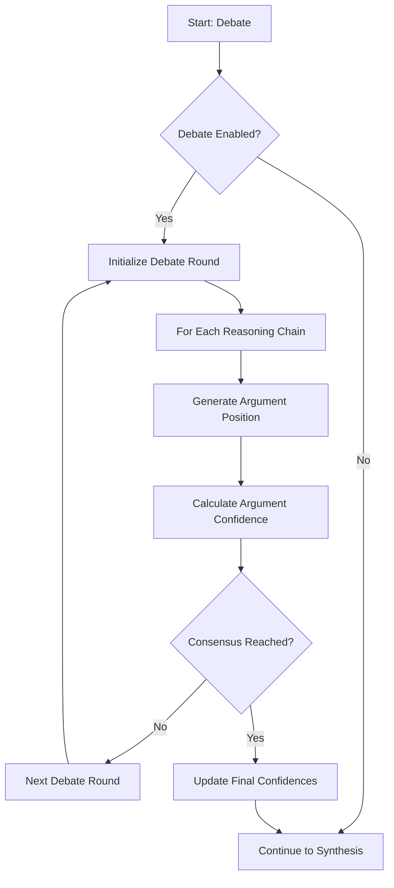

**BPMN Elements**:
- **Decision Gateway**: Check if debate enabled
- **Loop Sub-Process**: Debate rounds (max 3)
- **Business Rule**: Consensus detection algorithm

#### Phase 5: Answer Synthesis
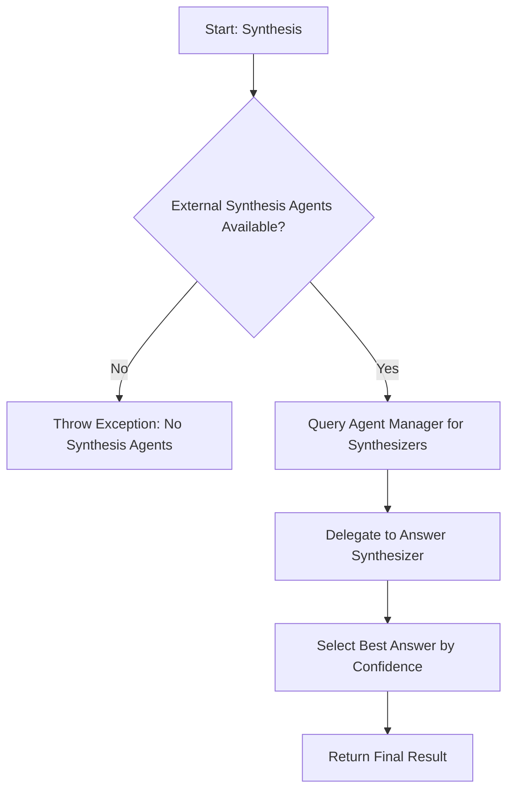

**BPMN Elements**:
- **Service Task**: Query Agent Manager for synthesizer agents
- **Business Rule**: Select highest confidence answer
- **End Event**: Return result

### 3. Internal Skills Breakdown

#### A. MultiAgentReasoningSkills Class

**Skills Available**:
1. **@a2a_skill**: `hierarchical_question_decomposition`
   - Input: question, max_depth, strategy, context
   - Process: Recursive decomposition using strategy patterns
   - Output: Hierarchical sub-question tree

2. **@a2a_skill**: `multi_agent_consensus`
   - Input: proposals, consensus_method, threshold
   - Process: Voting, weighted average, debate, or emergence
   - Output: Consensus result with confidence

3. **@a2a_skill**: `blackboard_reasoning`
   - Input: problem_context, knowledge_sources
   - Process: Pattern recognition, logical reasoning, evidence evaluation
   - Output: Integrated reasoning result

**Internal Methods**:
- `_decompose_recursively()` - Recursive question breakdown
- `_generate_sub_questions()` - Question generation strategies
- `_voting_consensus()` - Democratic voting mechanism
- `_weighted_consensus()` - Weighted average consensus
- `_debate_consensus()` - Adversarial debate process
- `_emergence_consensus()` - Emergent consensus detection

#### B. Circuit Breaker Integration
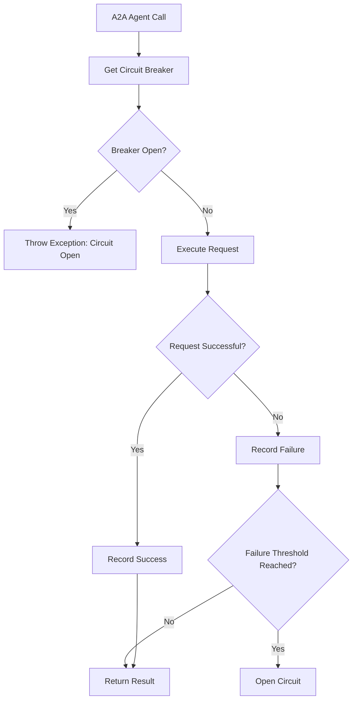

### 4. Sub-Agent Pool Management

#### Agent Role Mapping:
```
QUESTION_ANALYZER → QA Validation Agent (localhost:8007)
EVIDENCE_RETRIEVER → Data Manager (configured URL)
REASONING_ENGINE → Dynamic discovery via Catalog Manager
ANSWER_SYNTHESIZER → Dynamic discovery via Agent Manager
VALIDATOR → Dynamic discovery via Catalog Manager
```

#### Dynamic Agent Discovery Process:
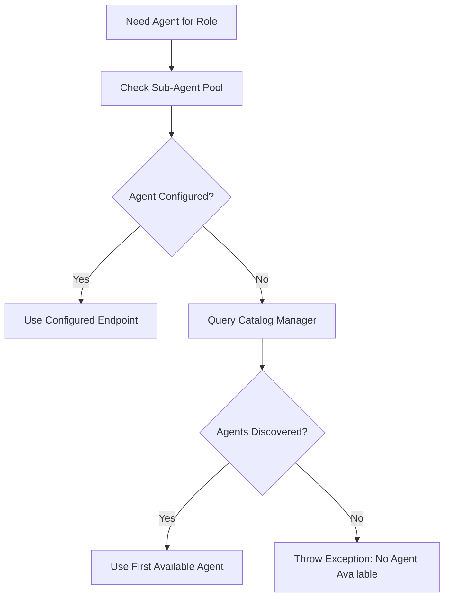

### 5. Blockchain Message Flow

#### Message Signing Process:
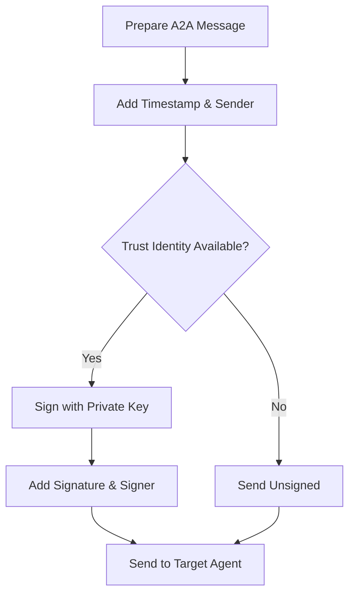

#### Message Verification Process:
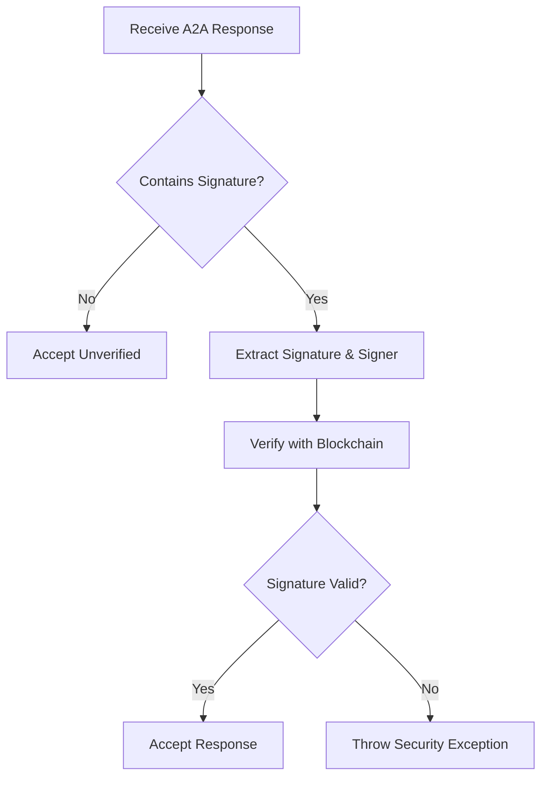

### 6. Error Handling & Failure Modes

#### No Fallback Policy:
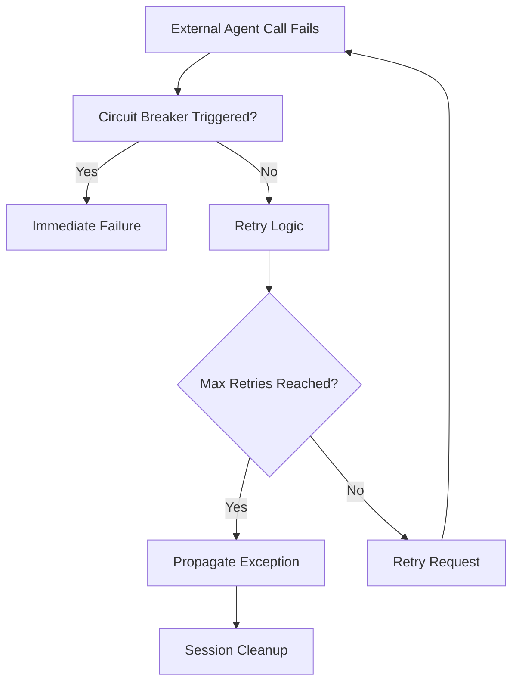

### 7. Performance Monitoring Integration

#### Metrics Collection:
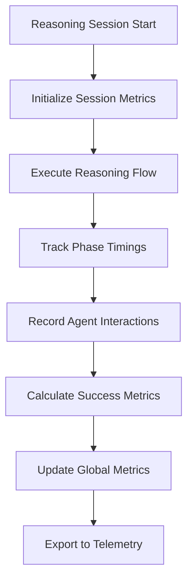

**Tracked Metrics**:
- `total_sessions`: Counter of reasoning sessions
- `successful_reasoning`: Counter of successful completions
- `average_confidence`: Average confidence scores
- `architecture_usage`: Usage per architecture type
- `average_reasoning_time`: Performance timing

### 8. Trust & Security Flow

#### Trust Initialization:
```mermaid
graph TD
    A[Agent Initialize] --> B[Load Private Key from ENV]
    B --> C[Call initialize_agent_trust()]
    C --> D[Register with Blockchain]
    D --> E[Store Trust Identity]
    E --> F[Enable Message Signing]
```

#### Trusted Agent Management:
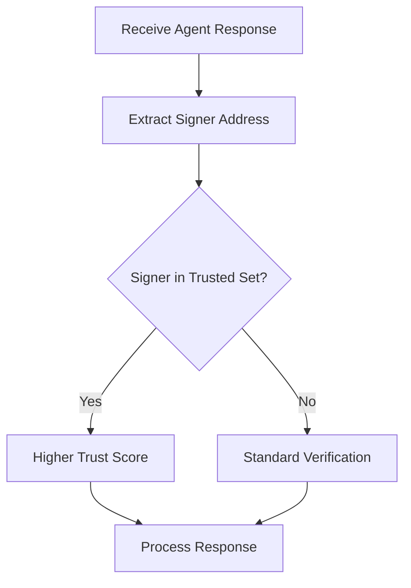

## Summary

The Reasoning Agent implements a sophisticated internal BPMN workflow with:

✅ **Proper BPMN Structure**:
- Clear start/end events
- Decision gateways for architecture selection
- Service tasks for external agent calls
- Multi-instance sub-processes for parallel execution
- Data stores for state management
- Error boundary events for exception handling

✅ **No Internal Fallbacks**:
- All reasoning delegated to external agents
- Proper error propagation
- Circuit breaker protection

✅ **Blockchain Integration**:
- Message signing/verification
- Trust identity management
- Security exception handling

The agent follows enterprise BPMN 2.0 patterns for reliable, auditable, and scalable multi-agent coordination.