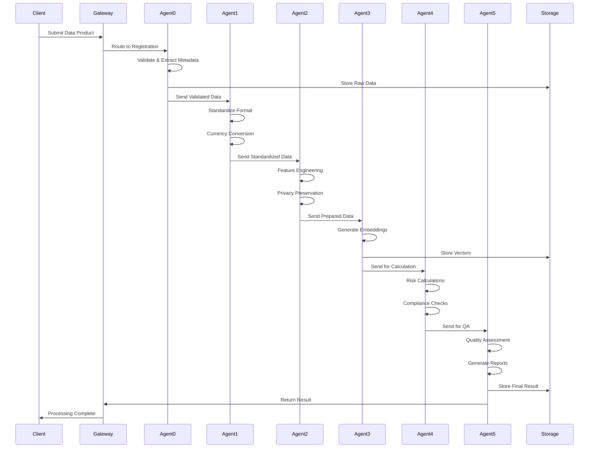

# Integration Points and Data Flow Documentation

## Complete Integration Architecture for A2A Platform

This document provides detailed documentation of all integration points, data flows, and system dependencies in the A2A Agent Platform.

---

## Table of Contents

1. [System Integration Overview](#system-integration-overview)
2. [External System Integrations](#external-system-integrations)
3. [Inter-Agent Communication](#inter-agent-communication)
4. [Data Flow Patterns](#data-flow-patterns)
5. [Event-Driven Architecture](#event-driven-architecture)
6. [Security Integration](#security-integration)
7. [Monitoring Integration](#monitoring-integration)

---

## System Integration Overview

### Integration Architecture

```
┌─────────────────────────────────────────────────────────────────────────┐
│                          External Systems                                │
├─────────────────────────────────────────────────────────────────────────┤
│ SAP S/4HANA │ SAP BTP │ Bloomberg │ Reuters │ Internal Systems         │
└────────┬────────┬──────────┬──────────┬──────────┬────────────────────┘
         │        │          │          │          │
┌────────┴────────┴──────────┴──────────┴──────────┴────────────────────┐
│                        Integration Layer                                 │
├─────────────────────────────────────────────────────────────────────────┤
│    SAP Cloud     │    API      │   Message    │    Event              │
│    Connector     │   Gateway   │    Queue     │    Mesh               │
└────────┬─────────────┬──────────────┬──────────────┬──────────────────┘
         │             │              │              │
┌────────┴─────────────┴──────────────┴──────────────┴──────────────────┐
│                        A2A Agent Platform                               │
├─────────────────────────────────────────────────────────────────────────┤
│  Agent 0 → Agent 1 → Agent 2 → Agent 3 → Agent 4 → Agent 5            │
│     ↓         ↓         ↓         ↓         ↓         ↓               │
│  ┌──────────────────────────────────────────────────────┐              │
│  │            Shared Services Layer                      │              │
│  │  Trust System │ ORD Registry │ Data Manager          │              │
│  └──────────────────────────────────────────────────────┘              │
└─────────────────────────────────────────────────────────────────────────┘
```

---

## External System Integrations

### 1. SAP S/4HANA Integration

#### Connection Details
```python
class S4HANAIntegration:
    """SAP S/4HANA integration for master data and transactions"""
    
    def __init__(self):
        self.config = {
            "base_url": "https://s4hana.company.com/sap/opu/odata/sap/",
            "auth_type": "oauth2",
            "client_id": "${S4HANA_CLIENT_ID}",
            "timeout": 30000,
            "retry_policy": {
                "max_retries": 3,
                "backoff_factor": 2
            }
        }
```

#### Integration Points

| API Endpoint | Purpose | Agent | Frequency |
|--------------|---------|--------|-----------|
| `/API_BUSINESS_PARTNER` | Customer/Vendor master data | Agent 0 | Real-time |
| `/API_PRODUCT` | Product master data | Agent 0 | Batch (daily) |
| `/API_FINANCIALDOCUMENT` | Financial documents | Agent 1 | Real-time |
| `/API_COSTCENTER` | Cost center data | Agent 4 | On-demand |

#### Data Synchronization Flow

```python
async def sync_master_data():
    """Synchronize master data from S/4HANA"""
    
    # Step 1: Fetch changed records
    changes = await s4hana.get_changes(
        entity="BusinessPartner",
        since=last_sync_timestamp,
        fields=["BusinessPartner", "BusinessPartnerName", "Currency"]
    )
    
    # Step 2: Transform to internal format
    for change in changes:
        internal_format = transform_s4hana_to_internal(change)
        
        # Step 3: Update local cache
        await cache.update(
            key=f"bp:{change.BusinessPartner}",
            value=internal_format,
            ttl=86400  # 24 hours
        )
        
        # Step 4: Notify dependent agents
        await message_queue.publish(
            topic="master_data_update",
            message={
                "entity_type": "business_partner",
                "entity_id": change.BusinessPartner,
                "change_type": change.ChangeType
            }
        )
```

### 2. SAP BTP Services Integration

#### Integrated Services

##### SAP Alert Notification Service
```python
class AlertNotificationIntegration:
    async def send_critical_alert(self, alert: Alert):
        payload = {
            "subject": alert.subject,
            "body": alert.body,
            "severity": "ERROR",
            "category": "BUSINESS_PROCESS",
            "tags": {
                "agent": alert.agent_id,
                "workflow": alert.workflow_id
            },
            "actions": [
                {
                    "type": "EMAIL",
                    "recipients": alert.recipients
                }
            ]
        }
        
        response = await self.http_client.post(
            f"{BTP_ANS_URL}/v1/alerts",
            json=payload,
            headers=self._get_auth_headers()
        )
```

##### SAP Event Mesh
```python
class EventMeshIntegration:
    def __init__(self):
        self.producer = EventProducer(
            broker_url=EVENT_MESH_URL,
            client_id="a2a-platform",
            topics=[
                "a2a/agent/status",
                "a2a/data/processed",
                "a2a/workflow/completed"
            ]
        )
    
    async def publish_event(self, event: DomainEvent):
        await self.producer.send(
            topic=f"a2a/{event.domain}/{event.type}",
            key=event.aggregate_id,
            value=event.to_json(),
            headers={
                "event-id": event.id,
                "correlation-id": event.correlation_id,
                "timestamp": event.timestamp.isoformat()
            }
        )
```

### 3. Market Data Provider Integration

#### Bloomberg Integration
```python
class BloombergDataIntegration:
    """Bloomberg Terminal API integration for market data"""
    
    async def fetch_market_data(self, request: MarketDataRequest):
        # Construct Bloomberg request
        bb_request = self.session.create_request("//blp/refdata/ReferenceDataRequest")
        
        for security in request.securities:
            bb_request.append("securities", security)
            
        for field in request.fields:
            bb_request.append("fields", field)
            
        # Send request and handle response
        response = await self.session.send_request_async(bb_request)
        
        # Transform Bloomberg data to internal format
        return self.transform_bloomberg_response(response)
```

#### Reuters Refinitiv Integration
```python
class ReutersDataIntegration:
    """Reuters Refinitiv Elektron integration"""
    
    def setup_streaming(self):
        self.consumer = StreamingConsumer(
            host=REUTERS_HOST,
            username=REUTERS_USER,
            app_id="A2A_PLATFORM"
        )
        
        # Subscribe to real-time updates
        self.consumer.subscribe(
            instruments=["EUR=", "GBP=", "JPY="],
            fields=["BID", "ASK", "TIMACT"],
            callback=self.handle_price_update
        )
    
    async def handle_price_update(self, update: PriceUpdate):
        # Store in time-series database
        await self.timeseries_db.insert(
            measurement="fx_rates",
            tags={"currency_pair": update.instrument},
            fields={
                "bid": update.bid,
                "ask": update.ask,
                "mid": (update.bid + update.ask) / 2
            },
            timestamp=update.timestamp
        )
```

---

## Inter-Agent Communication

### Message Queue Architecture

```python
class AgentMessageQueue:
    """RabbitMQ-based message queue for agent communication"""
    
    def __init__(self):
        self.connection = AsyncConnection(
            host=RABBITMQ_HOST,
            virtual_host="a2a-platform",
            credentials=PlainCredentials(MQ_USER, MQ_PASS)
        )
        
        # Define exchanges and queues
        self.exchanges = {
            "agent.direct": ExchangeType.DIRECT,
            "agent.topic": ExchangeType.TOPIC,
            "agent.fanout": ExchangeType.FANOUT
        }
        
        self.queues = {
            "agent0": {"routing_key": "registration.*"},
            "agent1": {"routing_key": "standardization.*"},
            "agent2": {"routing_key": "ai_prep.*"},
            "agent3": {"routing_key": "vector.*"},
            "agent4": {"routing_key": "calculation.*"},
            "agent5": {"routing_key": "qa.*"}
        }
```

### Agent Communication Patterns

#### 1. Request-Reply Pattern
```python
class RequestReplyPattern:
    async def send_request(self, target_agent: str, request: AgentRequest):
        correlation_id = str(uuid.uuid4())
        reply_queue = await self.channel.declare_queue(exclusive=True)
        
        # Send request with reply-to queue
        await self.channel.basic_publish(
            exchange="agent.direct",
            routing_key=f"{target_agent}.request",
            body=request.to_json(),
            properties=BasicProperties(
                reply_to=reply_queue.name,
                correlation_id=correlation_id,
                expiration=str(request.timeout_ms)
            )
        )
        
        # Wait for response
        response = await reply_queue.get(timeout=request.timeout_ms / 1000)
        return AgentResponse.from_json(response.body)
```

#### 2. Publish-Subscribe Pattern
```python
class PublishSubscribePattern:
    async def publish_event(self, event: AgentEvent):
        await self.channel.basic_publish(
            exchange="agent.fanout",
            routing_key="",
            body=event.to_json(),
            properties=BasicProperties(
                headers={
                    "event_type": event.type,
                    "source_agent": event.source,
                    "timestamp": event.timestamp.isoformat()
                }
            )
        )
```

#### 3. Pipeline Pattern
```python
class PipelinePattern:
    """Sequential processing through agent pipeline"""
    
    async def process_pipeline(self, data: Any, pipeline: List[str]):
        result = data
        context = PipelineContext()
        
        for agent in pipeline:
            # Send to next agent in pipeline
            request = AgentRequest(
                data=result,
                context=context,
                source_agent=pipeline[pipeline.index(agent) - 1] if pipeline.index(agent) > 0 else "system"
            )
            
            response = await self.send_to_agent(agent, request)
            
            # Check for errors
            if response.status != "success":
                await self.handle_pipeline_error(agent, response, context)
                break
                
            result = response.data
            context.add_step(agent, response.metadata)
            
        return result, context
```

---

## Data Flow Patterns

### 1. Standard Data Processing Flow



### 2. Error Handling Flow

```python
class ErrorHandlingFlow:
    async def handle_agent_error(self, error: AgentError, context: ProcessingContext):
        # Log error with full context
        await self.error_logger.log(
            level="ERROR",
            message=f"Agent {error.agent_id} failed",
            error=error,
            context=context
        )
        
        # Determine recovery strategy
        strategy = self.get_recovery_strategy(error)
        
        if strategy == RecoveryStrategy.RETRY:
            return await self.retry_with_backoff(error, context)
            
        elif strategy == RecoveryStrategy.FALLBACK:
            return await self.use_fallback_agent(error, context)
            
        elif strategy == RecoveryStrategy.COMPENSATE:
            return await self.compensate_transaction(error, context)
            
        else:  # FAIL_FAST
            await self.notify_failure(error, context)
            raise ProcessingFailedException(error)
```

### 3. Batch Processing Flow

```python
class BatchProcessingFlow:
    async def process_batch(self, batch_id: str, items: List[DataItem]):
        # Create batch context
        batch_context = BatchContext(
            batch_id=batch_id,
            total_items=len(items),
            start_time=datetime.utcnow()
        )
        
        # Process items in parallel with rate limiting
        semaphore = asyncio.Semaphore(self.config.max_parallel_items)
        
        async def process_item(item):
            async with semaphore:
                try:
                    result = await self.process_single_item(item, batch_context)
                    batch_context.record_success(item.id, result)
                except Exception as e:
                    batch_context.record_failure(item.id, str(e))
        
        # Process all items
        await asyncio.gather(*[process_item(item) for item in items])
        
        # Generate batch report
        return await self.generate_batch_report(batch_context)
```

---

## Event-Driven Architecture

### Event Types and Schemas

```python
@dataclass
class AgentEvent:
    """Base class for all agent events"""
    event_id: str = field(default_factory=lambda: str(uuid.uuid4()))
    event_type: str = ""
    timestamp: datetime = field(default_factory=datetime.utcnow)
    source_agent: str = ""
    correlation_id: Optional[str] = None
    metadata: Dict[str, Any] = field(default_factory=dict)

@dataclass
class DataProductRegisteredEvent(AgentEvent):
    """Emitted when a new data product is registered"""
    event_type: str = "data_product.registered"
    product_id: str = ""
    product_name: str = ""
    source_system: str = ""
    
@dataclass
class ProcessingCompletedEvent(AgentEvent):
    """Emitted when processing is completed"""
    event_type: str = "processing.completed"
    product_id: str = ""
    processing_time_ms: int = 0
    quality_score: float = 0.0
```

### Event Handlers

```python
class EventHandlerRegistry:
    def __init__(self):
        self.handlers: Dict[str, List[Callable]] = defaultdict(list)
    
    def register_handler(self, event_type: str, handler: Callable):
        self.handlers[event_type].append(handler)
    
    async def handle_event(self, event: AgentEvent):
        handlers = self.handlers.get(event.event_type, [])
        
        # Execute handlers in parallel
        await asyncio.gather(*[
            self._execute_handler(handler, event)
            for handler in handlers
        ])
    
    async def _execute_handler(self, handler: Callable, event: AgentEvent):
        try:
            await handler(event)
        except Exception as e:
            logger.error(f"Handler {handler.__name__} failed for event {event.event_id}: {e}")
```

### Event Sourcing Implementation

```python
class EventStore:
    """Event sourcing for audit and replay capability"""
    
    async def append_event(self, event: AgentEvent):
        # Store event in append-only log
        await self.db.execute(
            """
            INSERT INTO event_log (
                event_id, event_type, timestamp, source_agent,
                correlation_id, payload, metadata
            ) VALUES ($1, $2, $3, $4, $5, $6, $7)
            """,
            event.event_id,
            event.event_type,
            event.timestamp,
            event.source_agent,
            event.correlation_id,
            json.dumps(asdict(event)),
            json.dumps(event.metadata)
        )
        
        # Publish to event stream
        await self.event_stream.publish(event)
    
    async def replay_events(self, 
                          aggregate_id: str,
                          from_timestamp: Optional[datetime] = None):
        """Replay events for an aggregate"""
        
        query = """
            SELECT * FROM event_log
            WHERE correlation_id = $1
            AND ($2::timestamp IS NULL OR timestamp >= $2)
            ORDER BY timestamp
        """
        
        events = await self.db.fetch(query, aggregate_id, from_timestamp)
        
        for event_data in events:
            event = self._deserialize_event(event_data)
            await self.event_handlers.handle_event(event)
```

---

## Security Integration

### Authentication Flow

```python
class AuthenticationIntegration:
    """Multi-factor authentication integration"""
    
    async def authenticate_request(self, request: Request) -> AuthContext:
        # Extract authentication headers
        auth_header = request.headers.get("Authorization", "")
        api_key = request.headers.get("X-API-Key", "")
        
        # Try JWT authentication first
        if auth_header.startswith("Bearer "):
            token = auth_header[7:]
            return await self.validate_jwt(token)
        
        # Try API key authentication
        elif api_key:
            return await self.validate_api_key(api_key)
        
        # Try certificate authentication
        elif request.client_cert:
            return await self.validate_certificate(request.client_cert)
        
        raise AuthenticationError("No valid authentication provided")
    
    async def validate_jwt(self, token: str) -> AuthContext:
        try:
            # Decode and validate JWT
            payload = jwt.decode(
                token,
                self.public_key,
                algorithms=["RS256"],
                audience="a2a-platform"
            )
            
            # Check if token is revoked
            if await self.is_token_revoked(payload["jti"]):
                raise AuthenticationError("Token has been revoked")
            
            # Build auth context
            return AuthContext(
                user_id=payload["sub"],
                roles=payload.get("roles", []),
                permissions=payload.get("permissions", []),
                token_id=payload["jti"],
                expires_at=datetime.fromtimestamp(payload["exp"])
            )
            
        except jwt.ExpiredSignatureError:
            raise AuthenticationError("Token has expired")
        except jwt.InvalidTokenError as e:
            raise AuthenticationError(f"Invalid token: {e}")
```

### Authorization Integration

```python
class AuthorizationIntegration:
    """Fine-grained authorization with ABAC"""
    
    async def authorize_action(self,
                             auth_context: AuthContext,
                             resource: str,
                             action: str,
                             attributes: Dict[str, Any] = None) -> bool:
        # Build authorization request
        authz_request = {
            "subject": {
                "id": auth_context.user_id,
                "roles": auth_context.roles,
                "attributes": auth_context.attributes
            },
            "resource": {
                "type": resource.split(":")[0],
                "id": resource.split(":")[1] if ":" in resource else "*",
                "attributes": attributes or {}
            },
            "action": action,
            "environment": {
                "time": datetime.utcnow().isoformat(),
                "ip_address": auth_context.ip_address,
                "user_agent": auth_context.user_agent
            }
        }
        
        # Check with policy engine
        decision = await self.policy_engine.evaluate(authz_request)
        
        # Log authorization decision
        await self.audit_logger.log_authorization(
            user_id=auth_context.user_id,
            resource=resource,
            action=action,
            decision=decision.permit,
            reason=decision.reason
        )
        
        return decision.permit
```

---

## Monitoring Integration

### Metrics Collection

```python
class MetricsIntegration:
    """Prometheus metrics integration"""
    
    def __init__(self):
        # Define metrics
        self.request_counter = Counter(
            'a2a_requests_total',
            'Total requests processed',
            ['agent', 'method', 'status']
        )
        
        self.request_duration = Histogram(
            'a2a_request_duration_seconds',
            'Request duration in seconds',
            ['agent', 'method'],
            buckets=[0.1, 0.5, 1.0, 2.5, 5.0, 10.0]
        )
        
        self.active_connections = Gauge(
            'a2a_active_connections',
            'Number of active connections',
            ['agent']
        )
        
        self.processing_errors = Counter(
            'a2a_processing_errors_total',
            'Total processing errors',
            ['agent', 'error_type']
        )
    
    @contextmanager
    def track_request(self, agent: str, method: str):
        """Context manager to track request metrics"""
        
        # Increment active connections
        self.active_connections.labels(agent=agent).inc()
        
        # Start timing
        start_time = time.time()
        
        try:
            yield
            # Success
            self.request_counter.labels(
                agent=agent,
                method=method,
                status='success'
            ).inc()
            
        except Exception as e:
            # Error
            self.request_counter.labels(
                agent=agent,
                method=method,
                status='error'
            ).inc()
            
            self.processing_errors.labels(
                agent=agent,
                error_type=type(e).__name__
            ).inc()
            
            raise
            
        finally:
            # Record duration
            duration = time.time() - start_time
            self.request_duration.labels(
                agent=agent,
                method=method
            ).observe(duration)
            
            # Decrement active connections
            self.active_connections.labels(agent=agent).dec()
```

### Distributed Tracing

```python
class TracingIntegration:
    """OpenTelemetry distributed tracing"""
    
    def __init__(self):
        # Configure tracer
        self.tracer = trace.get_tracer(
            "a2a-platform",
            version="1.0.0"
        )
        
        # Configure exporter
        otlp_exporter = OTLPSpanExporter(
            endpoint=OTEL_COLLECTOR_ENDPOINT,
            headers={"api-key": OTEL_API_KEY}
        )
        
        # Set up span processor
        span_processor = BatchSpanProcessor(otlp_exporter)
        trace.get_tracer_provider().add_span_processor(span_processor)
    
    @contextmanager
    def trace_operation(self, 
                       operation_name: str,
                       attributes: Dict[str, Any] = None):
        """Create a traced operation span"""
        
        with self.tracer.start_as_current_span(
            operation_name,
            kind=SpanKind.INTERNAL
        ) as span:
            # Add attributes
            if attributes:
                for key, value in attributes.items():
                    span.set_attribute(key, value)
            
            # Add baggage
            ctx = baggage.set_baggage(
                "transaction.id",
                span.get_span_context().trace_id
            )
            
            try:
                yield span
            except Exception as e:
                # Record exception
                span.record_exception(e)
                span.set_status(
                    Status(StatusCode.ERROR, str(e))
                )
                raise
```

### Log Aggregation

```python
class LoggingIntegration:
    """Centralized logging with correlation"""
    
    def __init__(self):
        # Configure structured logging
        self.logger = structlog.get_logger()
        
        # Add processors
        structlog.configure(
            processors=[
                structlog.stdlib.filter_by_level,
                structlog.stdlib.add_logger_name,
                structlog.stdlib.add_log_level,
                structlog.stdlib.PositionalArgumentsFormatter(),
                structlog.processors.TimeStamper(fmt="iso"),
                structlog.processors.StackInfoRenderer(),
                structlog.processors.format_exc_info,
                structlog.processors.UnicodeDecoder(),
                self.add_trace_context,
                structlog.processors.JSONRenderer()
            ],
            context_class=dict,
            logger_factory=structlog.stdlib.LoggerFactory(),
            cache_logger_on_first_use=True,
        )
    
    def add_trace_context(self, logger, method_name, event_dict):
        """Add trace context to log entries"""
        
        # Get current span
        span = trace.get_current_span()
        if span and span.is_recording():
            span_context = span.get_span_context()
            event_dict["trace_id"] = format(span_context.trace_id, "032x")
            event_dict["span_id"] = format(span_context.span_id, "016x")
        
        # Add correlation ID from context
        correlation_id = context_var.get("correlation_id")
        if correlation_id:
            event_dict["correlation_id"] = correlation_id
        
        return event_dict
```

---

## Data Persistence Integration

### Multi-Database Strategy

```python
class DataPersistenceIntegration:
    """Multi-database integration for different data types"""
    
    def __init__(self):
        # SAP HANA for transactional data
        self.hana = HanaConnection(
            host=HANA_HOST,
            port=HANA_PORT,
            user=HANA_USER,
            password=HANA_PASSWORD,
            schema="A2A_PLATFORM"
        )
        
        # PostgreSQL for metadata and configuration
        self.postgres = PostgresConnection(
            host=POSTGRES_HOST,
            database="a2a_metadata",
            user=POSTGRES_USER,
            password=POSTGRES_PASSWORD
        )
        
        # MongoDB for unstructured data
        self.mongodb = MongoClient(
            MONGODB_CONNECTION_STRING
        )["a2a_platform"]
        
        # Redis for caching
        self.redis = aioredis.from_url(
            REDIS_URL,
            encoding="utf-8",
            decode_responses=True
        )
        
        # Elasticsearch for search
        self.elasticsearch = AsyncElasticsearch(
            hosts=[ELASTIC_HOST],
            http_auth=(ELASTIC_USER, ELASTIC_PASSWORD)
        )
    
    async def store_data_product(self, product: DataProduct):
        """Store data product across multiple databases"""
        
        # Transaction data in HANA
        await self.hana.execute(
            """
            INSERT INTO data_products (
                product_id, name, type, source_system,
                created_at, created_by
            ) VALUES (?, ?, ?, ?, ?, ?)
            """,
            product.id, product.name, product.type,
            product.source_system, product.created_at,
            product.created_by
        )
        
        # Metadata in PostgreSQL
        await self.postgres.execute(
            """
            INSERT INTO product_metadata (
                product_id, schema_version, validation_rules,
                processing_config, tags
            ) VALUES ($1, $2, $3, $4, $5)
            """,
            product.id, product.schema_version,
            json.dumps(product.validation_rules),
            json.dumps(product.processing_config),
            product.tags
        )
        
        # Raw data in MongoDB
        await self.mongodb.raw_data.insert_one({
            "_id": product.id,
            "data": product.raw_data,
            "format": product.data_format,
            "compression": product.compression_type,
            "timestamp": product.created_at
        })
        
        # Search index in Elasticsearch
        await self.elasticsearch.index(
            index="data_products",
            id=product.id,
            body={
                "name": product.name,
                "description": product.description,
                "tags": product.tags,
                "source_system": product.source_system,
                "created_at": product.created_at
            }
        )
        
        # Cache frequently accessed data
        await self.redis.setex(
            f"product:{product.id}",
            3600,  # 1 hour TTL
            json.dumps(product.to_cache_format())
        )
```

---

## Performance Optimization

### Caching Strategy

```python
class CachingStrategy:
    """Multi-level caching for performance optimization"""
    
    def __init__(self):
        # L1: In-memory cache (LRU)
        self.memory_cache = LRUCache(maxsize=1000)
        
        # L2: Redis cache
        self.redis_cache = RedisCache()
        
        # L3: CDN for static content
        self.cdn_cache = CDNCache()
    
    async def get_with_cache(self, 
                           key: str,
                           loader: Callable,
                           ttl: int = 3600) -> Any:
        """Get data with multi-level caching"""
        
        # Check L1 cache
        if key in self.memory_cache:
            return self.memory_cache[key]
        
        # Check L2 cache
        redis_value = await self.redis_cache.get(key)
        if redis_value:
            self.memory_cache[key] = redis_value
            return redis_value
        
        # Load from source
        value = await loader()
        
        # Update caches
        self.memory_cache[key] = value
        await self.redis_cache.setex(key, ttl, value)
        
        return value
```

---

*Last Updated: December 2024*
*Version: 1.0.0*