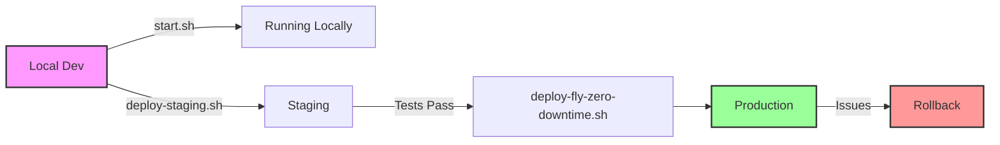

# Scripts Directory Structure

## Visual Overview

```
📁 scripts/
│
├── 📁 deployment/              🚀 Deployment & Infrastructure
│   └── 📁 fly/                 ☁️  Fly.io Platform
│       ├── deploy-fly.sh                  → Standard deployment
│       ├── deploy-fly-zero-downtime.sh    → Blue-green deployment
│       ├── deploy-staging.sh              → Staging environment
│       ├── manage-fly-secrets.sh          → Secrets management
│       ├── fly-db-migrate.sh              → Database migrations
│       ├── setup-custom-domain.sh         → Domain configuration
│       ├── start-fly.sh                   → Optimized startup
│       └── validate-fly-deployment.sh     → Health validation
│
├── 📁 operations/              🔧 Day-to-Day Operations
│   ├── start.sh                           → Main startup script
│   ├── stop.sh                            → Stop all services
│   ├── status.sh                          → Service status check
│   └── start-all-agents.sh                → Start 18 agents
│
├── 📁 testing/                 🧪 Testing & Validation
│   └── verify-18-steps.sh                 → Platform verification
│
└── 🔗 [Symlinks]              📎 Backward Compatibility
    ├── deploy-fly.sh          → deployment/fly/deploy-fly.sh
    ├── deploy-staging.sh      → deployment/fly/deploy-staging.sh
    ├── start.sh               → operations/start.sh
    └── ... (all other symlinks)
```

## Quick Reference by Task

### 🚀 **"I want to deploy to production"**
```bash
./scripts/deploy-fly-zero-downtime.sh
```

### 🧪 **"I want to test in staging first"**
```bash
./scripts/deploy-staging.sh
```

### 🔐 **"I need to update secrets"**
```bash
./scripts/manage-fly-secrets.sh set API_KEY "new-value"
```

### 🏃 **"I want to run locally"**
```bash
./scripts/start.sh
```

### 📊 **"I want to check deployment health"**
```bash
./scripts/validate-fly-deployment.sh
```

### 🗄️ **"I need to run database migrations"**
```bash
./scripts/fly-db-migrate.sh migrate
```

### 🌐 **"I want to add a custom domain"**
```bash
./scripts/setup-custom-domain.sh setup api.example.com
```

### 🛑 **"I need to stop everything"**
```bash
./scripts/stop.sh
```

### ✅ **"I want to verify the platform"**
```bash
./scripts/verify-18-steps.sh
```

## Color-Coded by Purpose

- 🟦 **Blue**: Deployment/Infrastructure
- 🟩 **Green**: Operations/Runtime
- 🟨 **Yellow**: Testing/Validation
- 🟥 **Red**: Emergency/Recovery
- 🟪 **Purple**: Configuration/Setup

## Execution Flow



## Script Categories

### 🏗️ **Infrastructure Scripts**
- Deployment automation
- Environment setup
- Resource management
- Scaling operations

### 🎯 **Operational Scripts**
- Service lifecycle
- Health monitoring
- Log management
- Performance tuning

### 🔍 **Diagnostic Scripts**
- Status checks
- Log analysis
- Error detection
- Performance metrics

### 🛡️ **Security Scripts**
- Secret management
- SSL certificates
- Access control
- Audit trails

## Best Practices

1. **Always run from project root**
   ```bash
   cd /path/to/a2a
   ./scripts/script-name.sh
   ```

2. **Check prerequisites**
   ```bash
   ./scripts/validate-fly-deployment.sh
   ```

3. **Use staging first**
   ```bash
   ./scripts/deploy-staging.sh
   ```

4. **Monitor after deployment**
   ```bash
   flyctl logs --app a2a-platform
   ```

5. **Keep secrets secure**
   ```bash
   ./scripts/manage-fly-secrets.sh validate
   ```