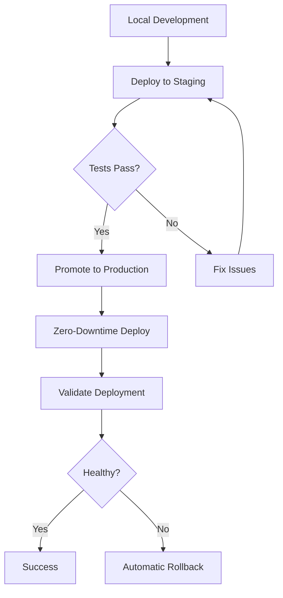

# Fly.io Deployment Scripts

This directory contains all scripts specific to Fly.io deployment and management.

## Scripts Overview

### 🚀 Deployment
- **`deploy-fly.sh`** - Standard deployment to Fly.io
- **`deploy-fly-zero-downtime.sh`** - Blue-green deployment with zero downtime
- **`deploy-staging.sh`** - Deploy to staging environment with automatic tests

### 🔐 Configuration
- **`manage-fly-secrets.sh`** - Manage secrets and environment variables
- **`setup-custom-domain.sh`** - Configure custom domains with SSL certificates

### 🗄️ Database
- **`fly-db-migrate.sh`** - Database migration management

### 🔍 Validation
- **`validate-fly-deployment.sh`** - Health checks and deployment validation

### 🏃 Runtime
- **`start-fly.sh`** - Optimized startup script (used internally by Docker)

## Quick Start

```bash
# Set up your Fly.io token
export FLY_API_TOKEN=your-fly-token

# Deploy to production
./deploy-fly-zero-downtime.sh

# Or deploy to staging first
./deploy-staging.sh
```

## Deployment Workflow



## Environment Variables

Required:
- `FLY_API_TOKEN` - Your Fly.io API token
- `FLY_APP_NAME` - App name (default: a2a-platform)

Optional:
- `DOCKER_IMAGE` - Docker image to deploy
- `FLY_REGION` - Deployment region (default: ord)

## Common Tasks

### Deploy with Zero Downtime
```bash
./deploy-fly-zero-downtime.sh
```

### Manage Secrets
```bash
# List secrets
./manage-fly-secrets.sh list

# Set a secret
./manage-fly-secrets.sh set DATABASE_URL "postgresql://..."

# Setup all production secrets
./manage-fly-secrets.sh setup-production
```

### Database Migrations
```bash
# Check status
./fly-db-migrate.sh status

# Run migrations
./fly-db-migrate.sh migrate

# Create backup
./fly-db-migrate.sh backup
```

### Custom Domains
```bash
# Setup domain
./setup-custom-domain.sh setup api.example.com

# Check certificate status
./setup-custom-domain.sh status api.example.com
```

## Troubleshooting

### Deployment Fails
1. Check logs: `flyctl logs --app a2a-platform`
2. Validate deployment: `./validate-fly-deployment.sh`
3. Check secrets: `./manage-fly-secrets.sh validate`

### Rollback
```bash
# List releases
flyctl releases list --app a2a-platform

# Rollback
flyctl rollback --app a2a-platform
```